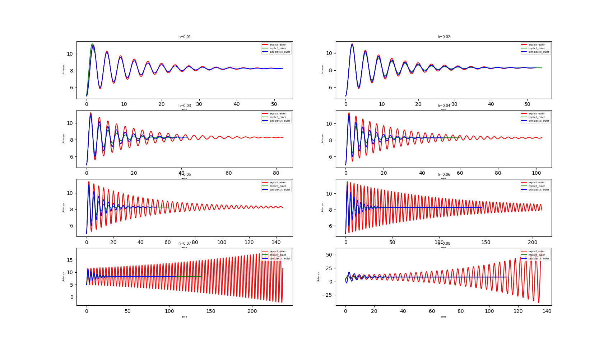

## HW2: ODE solver for a spring-damper system (a.k.a. Harmonic oscillator)

### Build and execute source code (Windows)
{path to vcpkg} 를 vcpkg 가 설치되어 있는 경로로 수정 후 다음 명령어를 터미널에서 입력하여 빌드 합니다.
```shell
cd source_code
mkdir build
cd build
cmake -DCMAKE_BUILD_TYPE=Debug -DCMAKE_TOOLCHAIN_FILE={path to vcpkg}\scripts\buildsystems\vcpkg.cmake -S ../ -B ./
cmake --build .
cd ./HW2/Debug
HW2.exe
```

### Execute existed executable file (Windows)
```
cd executable
HW2.exe
```

### Analyze implemented solver

(gravity = 9.8 m/s^2, ks = 15 N/m, kd = 1 N/m, mass = 5 Kg, v0 = 0, start length = 5 m,rest length = 5m)

time step 을 0.01s 부터 0.08s 까지 0.01s 씩 증가시켜서 Explicit Euler, Symplectic Euler, Implicit Euler 방법으로 실행한 결과를 분석해보자면, time step 이 비교적 작은 경우 (time step < 0.6) 세 방법 모두 distance 값이 수렴합니다. 그러나 explicit euler 방식은 time step 0.7 보다 커질 때 발산하는 그래프 형상을 띄고 있습니다. 따라서 Symplectic Euler 와 Implicit Euler 는 Explicit Euler 방식에 비해서 비교적 accurate 하고 stable 하다고 볼 수 있습니다. efficient 는 계산량을 가지고 비교해보자면 Explicit Euler 가 가장 계산량이 적어서 효율적이고, Symplectic method, Implicit Euler 순으로 효율적입니다.


### Reference
https://github.com/rinthel/opengl_course/tree/main/projects/10_object/object_example